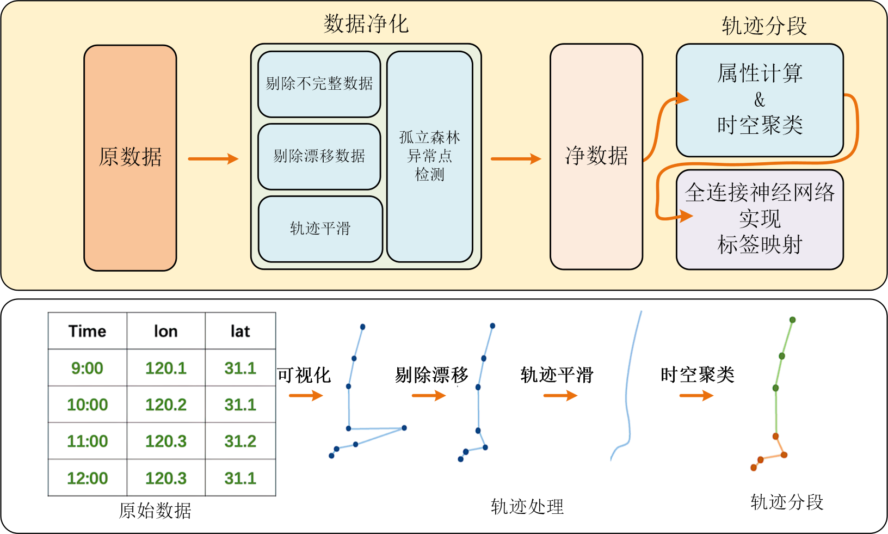
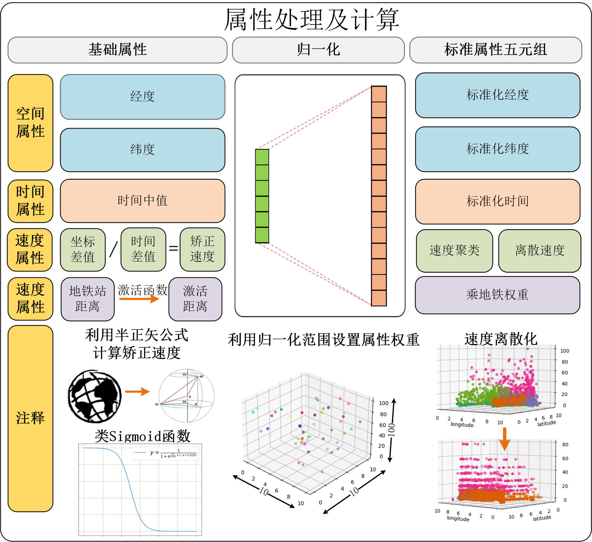
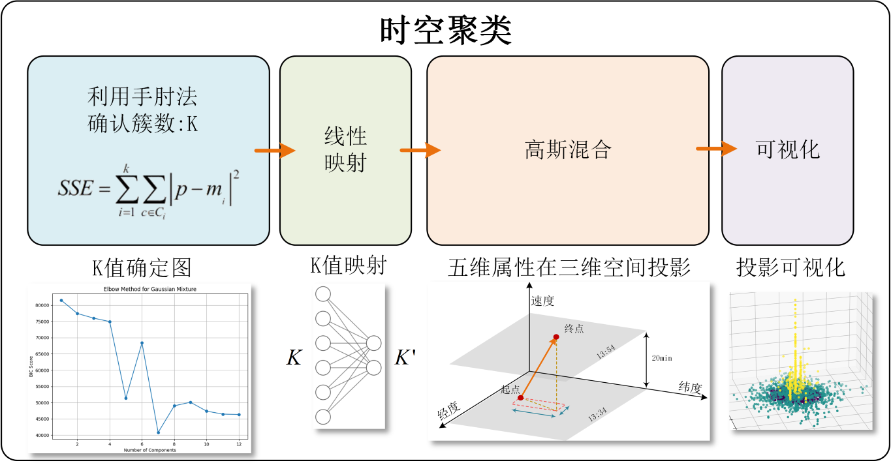
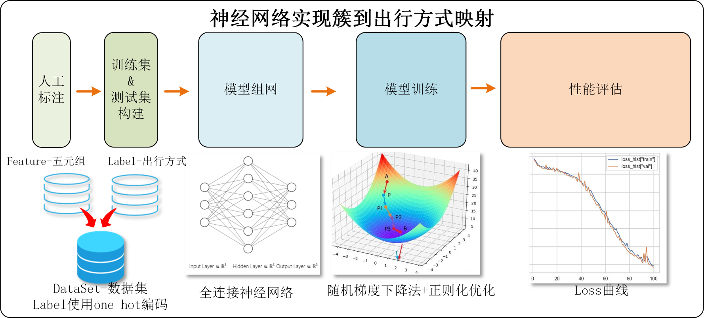

# 摘要		

 <div align="center">  </div>

 <div align="center">  </div>

 <div align="center">  </div>

 <div align="center">  </div>

  通过用户OD数据表示的行程信息的分段任务主要可以划分为两个部分，分别是行程链划分和行程段识别。行程链划分是指通过分析用户行程点将连续的用户行程划分为离散的行程段, 而行程段识别是指将离散的行程段与用户的出行方式相映射。对于用户出行链的预测问题, 本文使用了循环神经网络中经典的长短期记忆网络(LSTM), 我们将任务二中获得的数据用于训练LSTM, 使得LSTM能够很好地收敛。

  对于行程链划分问题, 本文考虑使用五个属性, 即[经度, 纬度, 时间点, 速度, 乘坐地铁的可能性], 来对一个行程点进行描述, 然后通过基于高斯混合无监督聚类算法开发的时空-速度-权重-高斯混合聚类算法(TSSW聚类)对行程点进行聚类分析。其中，对于速度属性本文使用了KMeans聚类算法将连续的速度划分为十个离散的速度等级以增强聚类算法的易收敛性, 对于乘坐地铁的可能性本文设计了平滑的类Sigmoid函数来适应权重映射和反向梯度传播算法。

  对于行程段识别问题，本文考虑使用全连接神经网络实现五维属性到出行方式的非线性映射。

  对于行程链预测问题, 本文考虑使用三个属性, 即[经度，纬度，时间点], 来描述一个行程点。将任务二中人工和全连接神经网络标注的数据作为循环神经网络的训练集和验证集进行训练和检测。经实验证明, 我们的方法可以使LSTM很好地收敛。

  除了在学术上的贡献，本文在软件工程领域也作出了贡献。在数据读取上，本文设计了Cache结构避免了对磁盘中的数据重复读取; 在轨迹处理上，本文去除了漂移点并使用卡尔曼滤波对轨迹进行平滑处理; 在高精度定位上，本文实现了WGS84到GCJ02坐标系的高精度转换，坐标可以精确到小数点五位; 在可视化设计上，本文设计了五维行程点到三维空间的投影和高精地图标点; 在代码风格上，本文的代码严格符合“高内聚，低耦合”和面向对象的设计思想。

  综上, 本文以较高的软件工程水平实现了一个基于TSSW时空聚类、FCNN和RNN的时空大数据分析系统, 实现了对用户出行链的分段, 识别, 评估。

# 环境配置

- `pandas == 2.0.3`：用于数据处理和分析。
- `webbrowser`：用于在默认浏览器中打开地图文件。
- `folium = 0.14.0`：用于地图可视化。
- `datetime`：用于处理时间数据。
- `os`：用于系统操作。
- `torch`: 用于神经网络构建和训练
- `transbigdata`: 用于轨迹处理

# 使用方法

## 人工划分
```shell
python main.py cluster label
```
## FCNN划分
```shell
python main.py cluster FCNN
```
## 自动化用户轨迹标注与分析工具
```shell
python main.py Mission1
```
## FCNN全连接神经网络训练
```shell
python main.py train FCNN
```
## RNN循环神经网络训练
```shell
python main.py train FCNN
```
## RNN实现轨迹预测
```shell
python main.py predict
```

# 功能


1. 行程链划分及可视化，提供时空聚类分段方式和两种映射方式
   1. 人工划分: 将经过时空聚类算法分类的簇与交通方式映射
   2. 全连接神经网络: 利用训练好的全连接神经网络实现簇到交通方式的映射
2. 任务一中的自动化用户轨迹标注与分析工具
3. 全连接神经网络训练
4. RNN
   1. 循环神经网络训练
   2. 循环神经网络预测
